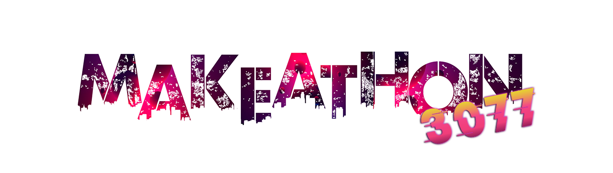

# MAKEATHON

## Index

1. [About MAKEATHON](#about-makeathon)
2. [About MLSC](#about-mlsc)
3. [Features](#features)
4. [Tech](#tech)
5. [LICENSE](#license)
6. [Contributing](#contributing)
7. [Contributors](#contributors)

## About MAKEATHON

**Makeathon 3077**- the paradigmatic **Hackathon** of Thapar Institute of Engineering and Technology,is one of MLSC's superlative flagship events. A **36 hour** event for students to challenge their technical boundaries by learning the latest technologies, procuring solutions, and developing fun projects. The event intends to bring together astute and industrious students from various colleges for a ravishing technical journey consisting of pre-event workshops and a Bootcamp.

## About MLSC

**Microsoft Learn Student Chapter** is a technical society that is dedicated to elevate the coding culture of Thapar Institute of Engineering and Technology by mentoring and motivating its students to refine their critical thinking, logical reasoning, and coding skills. MLSC was formed with the objective of providing students a dynamic platform that feeds their curiosity and develops their technical skills. MLSC aims to create a community of versatile enthusiasts with a progressive mindset, promoting development holistically which includes injecting soft skills as well. MLSC effectuates it by organizing numerous technology-driven events including **Tech Meetups**, **Hackathons** and promoting team building.

## Features

## Tech

- Html
- CSS
- JavaScript
- jQuery
- Bootstrap
- Django
- Travis CI

## LICENSE

This project is licensed under GNU General Public License- see [LICENSE](./LICENSE) for details.

## Contributing

Contributions are always welcome! Please see our [Contributing Guide](./CONTRIBUTING.md) for more details.

## Contributors

